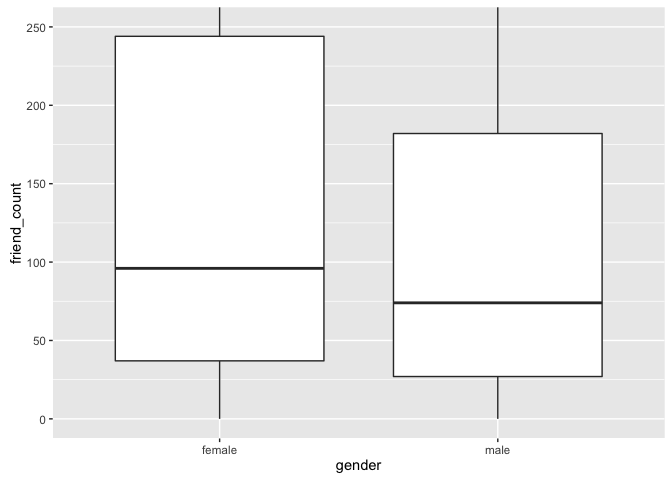

# pseudo Facebook Analysis
Stacey Lee  
March 30, 2016  
### Load libraries and file

```r
library(ggplot2)
```

```
## Warning: package 'ggplot2' was built under R version 3.1.3
```

```r
pf <- read.csv('pseudo_facebook (1).tsv', sep = '\t')
```

### Plot histogram of birthdays

```r
ggplot(data = pf, aes(x = dob_day)) + 
  geom_histogram(binwidth = 1) + 
  scale_x_continuous(breaks = 1:31) + 
  facet_wrap(~dob_month) + xlab('Birthdate') + 
  ylab('Number of users with birthdate')
```

<!-- -->

### Plot histogram of friend count

```r
ggplot(data = pf, aes(x = friend_count)) + geom_histogram() +
  scale_x_continuous(limits = c(0, 1000), breaks = seq(0, 1000, 50)) + 
  xlab('Friend count') + 
  ylab('Number of users with x friends')
```

```
## `stat_bin()` using `bins = 30`. Pick better value with `binwidth`.
```

```
## Warning: Removed 2951 rows containing non-finite values (stat_bin).
```

<!-- -->

```r
ggplot(data = pf, aes(x = friend_count)) + geom_histogram() + 
  scale_x_log10() + xlab('Log of friend count') + 
  ylab('Number of users with x friends')
```

```
## `stat_bin()` using `bins = 30`. Pick better value with `binwidth`.
```

```
## Warning: Removed 1962 rows containing non-finite values (stat_bin).
```

<!-- -->

```r
ggplot(data = pf, aes(x = friend_count)) + geom_histogram() + 
  scale_x_sqrt() + xlab('Square root of friend count') + 
  ylab('Number of users with x friends')
```

```
## `stat_bin()` using `bins = 30`. Pick better value with `binwidth`.
```

<!-- -->

### Plot histogram of friend count by gender

```r
table(pf$gender)
```

```
## 
## female   male 
##  40254  58574
```

```r
by(pf$friend_count, pf$gender, summary)
```

```
## pf$gender: female
##    Min. 1st Qu.  Median    Mean 3rd Qu.    Max. 
##       0      37      96     242     244    4923 
## -------------------------------------------------------- 
## pf$gender: male
##    Min. 1st Qu.  Median    Mean 3rd Qu.    Max. 
##       0      27      74     165     182    4917
```

```r
ggplot(aes(x = friend_count, y = ..count../sum(..count..)), data = subset(pf, !is.na(gender))) +
  geom_freqpoly(aes(color = gender), binwidth=10) + 
  scale_x_continuous(limits = c(0, 1000), breaks = seq(0, 1000, 50)) +
  xlab('Friend count') + 
  ylab('Percentage of users with x friends')
```

```
## Warning: Removed 2949 rows containing non-finite values (stat_bin).
```

```
## Warning: Removed 4 rows containing missing values (geom_path).
```

<!-- -->

### Plot histogram of tenure on facebook

```r
ggplot(aes(x = tenure / 365), data = pf) + 
  geom_histogram(color = 'black', fill = '#F79420') + 
  scale_x_continuous(breaks = seq(1, 7, 1), limits = c(0, 7)) + 
  xlab('Number of years using Facebook') + 
  ylab('Number of users in sample')
```

```
## `stat_bin()` using `bins = 30`. Pick better value with `binwidth`.
```

```
## Warning: Removed 26 rows containing non-finite values (stat_bin).
```

<!-- -->

### Plot histogram of age

```r
ggplot(aes(x = age), data = pf) + 
  geom_histogram(binwidth = 1, fill = '#5761AB') + 
  scale_x_continuous(breaks = seq(13, 113, 5)) + 
  xlab('Age') + 
  ylab('Number of users in sample')
```

<!-- -->

### Plot histogram of likes generated by gender

```r
ggplot(aes(x = www_likes), data = subset(pf, !is.na(gender))) + 
  geom_freqpoly(aes(color = gender)) + 
  scale_x_log10() + xlab('Number of likes generated') + ylab('Number of users in sample')
```

```
## `stat_bin()` using `bins = 30`. Pick better value with `binwidth`.
```

```
## Warning: Removed 60935 rows containing non-finite values (stat_bin).
```

<!-- -->

```r
by(pf$www_likes, pf$gender, sum)
```

```
## pf$gender: female
## [1] 3507665
## -------------------------------------------------------- 
## pf$gender: male
## [1] 1430175
```

### Plot boxplot of friend count by gender

```r
by(pf$friend_count, pf$gender, summary)
```

```
## pf$gender: female
##    Min. 1st Qu.  Median    Mean 3rd Qu.    Max. 
##       0      37      96     242     244    4923 
## -------------------------------------------------------- 
## pf$gender: male
##    Min. 1st Qu.  Median    Mean 3rd Qu.    Max. 
##       0      27      74     165     182    4917
```

```r
qplot(x = gender, y = friend_count, data = subset(pf, !is.na(gender)),
      geom = 'boxplot') + coord_cartesian(ylim = c(0, 250))
```

<!-- -->

### Plot boxplot of friendships initiated by gender

```r
by(pf$friendships_initiated, pf$gender, summary)
```

```
## pf$gender: female
##    Min. 1st Qu.  Median    Mean 3rd Qu.    Max. 
##     0.0    19.0    49.0   113.9   124.8  3654.0 
## -------------------------------------------------------- 
## pf$gender: male
##    Min. 1st Qu.  Median    Mean 3rd Qu.    Max. 
##     0.0    15.0    44.0   103.1   111.0  4144.0
```

```r
qplot(x = gender, y = friendships_initiated, data = subset(pf, !is.na(gender)),
      geom = 'boxplot') + coord_cartesian(ylim = c(0, 150))
```

<!-- -->

# Mobile check in analysis

```r
summary(pf$mobile_likes)
```

```
##    Min. 1st Qu.  Median    Mean 3rd Qu.    Max. 
##     0.0     0.0     4.0   106.1    46.0 25110.0
```

```r
summary(pf$mobile_likes > 0)
```

```
##    Mode   FALSE    TRUE    NA's 
## logical   35056   63947       0
```

```r
mobile_check_in <- NA
pf$mobile_check_in <- ifelse(pf$mobile_likes > 0, 1, 0)
pf$mobile_check_in <- factor(pf$mobile_check_in)
summary(pf$mobile_check_in)
```

```
##     0     1 
## 35056 63947
```

```r
sum(pf$mobile_check_in == 1)/length(pf$mobile_check_in)
```

```
## [1] 0.6459097
```

