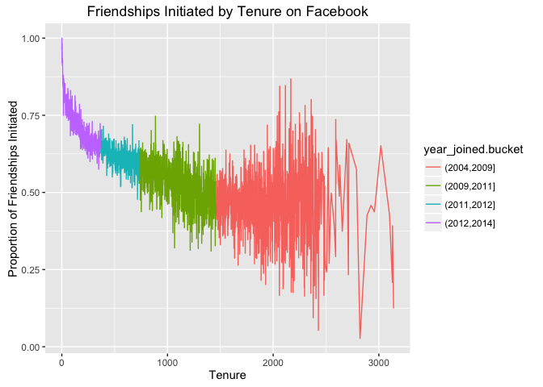
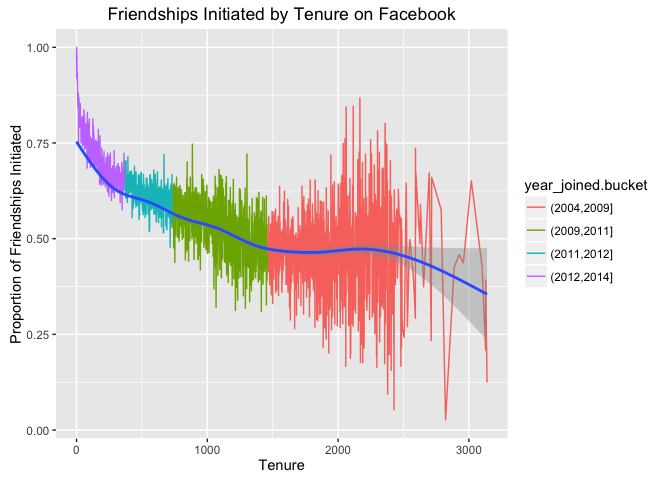

# pseudo Facebook Pt 2
### Load the data and libraries

```r
library(ggplot2)
```

```
## Warning: package 'ggplot2' was built under R version 3.1.3
```

```r
library(dplyr)
```

```
## Warning: package 'dplyr' was built under R version 3.1.3
```

```
## 
## Attaching package: 'dplyr'
```

```
## The following objects are masked from 'package:stats':
## 
##     filter, lag
```

```
## The following objects are masked from 'package:base':
## 
##     intersect, setdiff, setequal, union
```

```r
library(tidyr)
```

```
## Warning: package 'tidyr' was built under R version 3.1.3
```

```r
df <- read.csv("pseudo_facebook (1).tsv", sep = "\t")
```

### Many interesting variables are derived from two or more others. For example, we might wonder how much of a person's network on a service like Facebook the user actively initiated. Two users with the same degree (or number of friends) might be very different if one initiated most of those connections on the service, while the other initiated very few. So it could be useful to consider this proportion of existing friendships that the user initiated. This might be a good predictor of how active a user is compared with their peers, or other traits, such as personality (i.e., is this person an extrovert?).

### Your task is to create a new variable called 'prop_initiated' in the Pseudo-Facebook data set. The variable should contain the proportion of friendships that the user initiated.

### *Filter out people with no friends then add new variable 'prop_initiated'*

```r
dfPropInit <- df %>% filter(friend_count > 0) %>% mutate(prop_initiated = friendships_initiated/friend_count)
```

### Create a line graph of the median proportion of friendships initiated ('prop_initiated') vs. tenure and color the line segment by year_joined.bucket. Recall, we created year_joined.bucket in Lesson 5 by first creating year_joined from the variable tenure. Then, we used the cut function on year_joined to create four bins or cohorts of users.

* (2004, 2009]
* (2009, 2011]
* (2011, 2012]
* (2012, 2014]

### *Create year_joined variable*

```r
dfPropInit <- mutate(dfPropInit, year_joined = floor(2014 - tenure/365))
```

### *Cut year_joined into 4 bins*

```r
dfPropInit <- mutate(dfPropInit, year_joined.bucket = cut(dfPropInit$year_joined, breaks = c(2004,2009,2011,2012,2014)))
```

### *Plot line graph*

```r
ggplot(aes(x = tenure, y = prop_initiated), data = dfPropInit) + 
  geom_line(aes(color = year_joined.bucket), stat = "summary", fun.y = median) +
  labs(title = "Friendships Initiated by Tenure on Facebook", x = "Tenure", 
       y = "Proportion of Friendships Initiated")
```

```
## Warning: Removed 2 rows containing non-finite values (stat_summary).
```

<!-- -->

### Smooth the last plot you created of prop_initiated vs tenure colored by year_joined.bucket. You can bin together ranges of tenure or add a smoother to the plot.

```r
ggplot(aes(x = tenure, y = prop_initiated), data = dfPropInit) + 
  geom_line(aes(color = year_joined.bucket), stat = "summary", fun.y = median) +
  stat_smooth() +
  labs(title = "Friendships Initiated by Tenure on Facebook", x = "Tenure", 
       y = "Proportion of Friendships Initiated")
```

```
## Warning: Removed 2 rows containing non-finite values (stat_summary).
```

```
## Warning: Removed 2 rows containing non-finite values (stat_smooth).
```

<!-- -->

